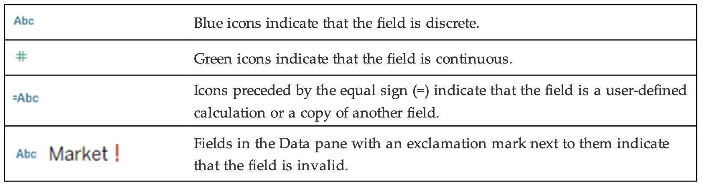

# Intro to Tableau

Table of Contents
	1.	Introduction to Tableau
	2.	Key Features of Tableau
	•	Connect to Data
	•	Build Visualizations
	•	Share Insights
	3.	Application Terminology
	•	Desktop Application
	•	Browser Environment
	4.	Visual Cues in Tableau
	5.	Getting Started with Tableau

# Introduction to Tableau

Tableau is a robust end-to-end data and analytics platform designed to help users connect to data, create insightful visualizations, and share their findings effortlessly. Its flexibility makes it suitable for various user environments, whether you're working on Tableau Desktop or leveraging the browser-based platform.

## Key Features of Tableau

### Connect to Data
Tableau seamlessly integrates with multiple data sources, allowing users to quickly connect and start building visualizations. You can blend and join data from spreadsheets, databases, cloud services, and more.

### Build Visualizations
Using the Data and Analytics panes, you can drag and drop fields to Rows and Columns shelves, apply calculations, and add reference lines or trends. The intuitive interface ensures that even beginners can create compelling visuals.

### Share Insights
With a simple click, publish your workbooks to Tableau Server or Tableau Cloud for collaboration and sharing. Sharing options ensure stakeholders have real-time access to the latest insights.

---

## Application Terminology

### Desktop Application

| **Term** | **Description** |
|-----------|-----------------|
| 1. Go to Start Page | Toggle between the active sheet and the Desktop Start Page. |
| 2. Data pane | Includes dimensions and measures, populated from your selected data source. May also include calculated fields, parameters, or sets. |
| 3. Analytics pane | Includes options you can use to apply reference lines, forecasts, trend lines, to add totals to crosstabs, and to build boxplots. |
| 4. Workbook name | The file name of your workbook. |
| 5. View cards | Used for modifying the worksheet. |
| 6. Toolbar icons | Icons are available for quick access to popular features. |
| 7. Rows and Columns shelves | Drag fields here to add them to the visualization. |
| 8. Worksheet/View | Workspace for building your visualizations. |
| 9. Go to Data Source | Returns you to the data source specification page. |
| 10. Worksheet tabs | Click to view a specific worksheet, dashboard, or story. |
| 11. New Worksheet, Dashboard, and Story tabs | Click to create a new Worksheet, Dashboard, or Story. |

### Browser Environment

| **Term** | **Description** |
|-----------|-----------------|
| 1. Data pane | Includes dimensions and measures, populated from your selected data source. May also include calculated fields, parameters, or sets. |
| 2. Analytics pane | Includes options you can use to apply reference lines, trend lines, to add totals to crosstabs, and to build boxplots. |
| 3. View cards | Used for modifying the worksheet. |
| 4. Toolbar icons | Icons are available for quick access to popular features. |
| 5. Rows and Columns shelves | Drag fields here to add them to the visualization. |
| 6. Workbook name | The name of your workbook. |
| 7. Worksheet/View | Workspace for building your visualizations. |
| 8. Publish button | Lets you publish your workbook to a project on the site. |
| 9. Go to Data Source | Returns you to the data source specification page. |
| 10. Worksheet tabs | Click to view a specific worksheet, dashboard, or story. |
| 11. New Worksheet, Dashboard, and Story tabs | Click to create a new Worksheet, Dashboard, or Story. |

---

## Visual Cues in Tableau

Understanding Tableau’s visual cues helps streamline your workflow. Tableau displays the following visual cues in the Data pane and the view.

### Modifiers
The following table explains how each of the field icons displayed in the Data pane can be modified by one of four indicators:

### Fields in the Data Pane
These are the primary fields you will see in the Data pane. For a complete list, see the topic "Visual Cues
and Icons in Tableau Desktop" in the Tableau Desktop Help menu.

### Fields on Shelves

---
Additional resources:
1. https://help.tableau.com/current/pro/desktop/en-us/datafields_typesandroles.htm
2. https://www.tableau.com/learn/get-started/data-structure
## Getting Started with Tableau

Whether you're a Creator working with complex datasets or an Explorer focusing on visualization, Tableau provides a scalable platform to suit your role. Begin by exploring the Start Page, experimenting with data connections, and leveraging visual cues to build dynamic dashboards.

By mastering these essentials, Tableau can become an indispensable tool in your analytics toolkit. Dive in, and start turning data into actionable insights today!
